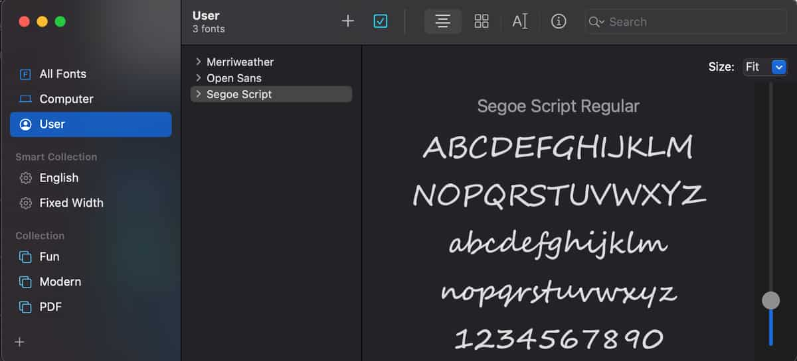
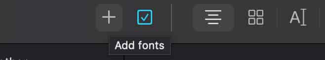
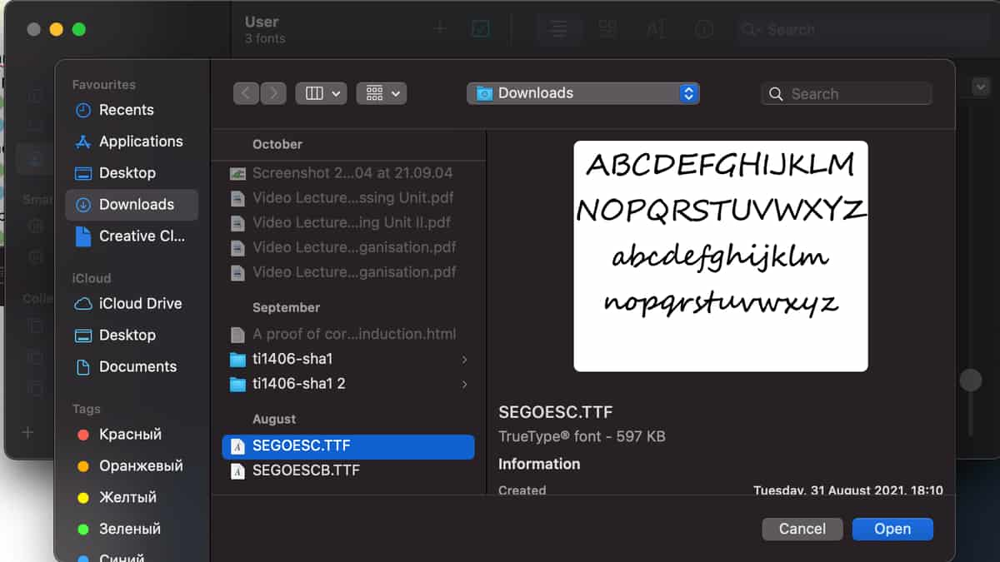

# Технические Моменты

## Установка шрифтов macOS

-   Откройте приложение "font Book".
<figure markdown>
{ width="600" }
</figure>

-   Нажмите на "add fonts".
<figure markdown>
{ width="600" }
</figure>

-   Выберете скаченный файл и нажмите на "Open".
<figure markdown>
{ width="600" }
</figure>
