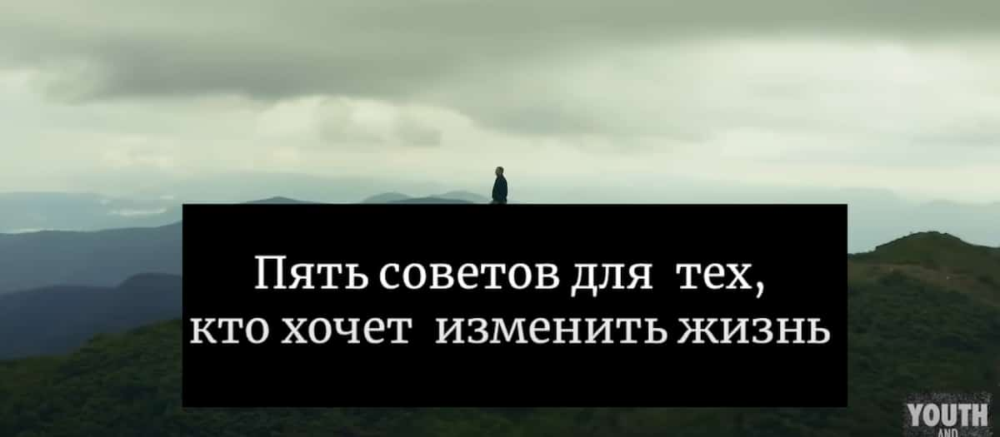
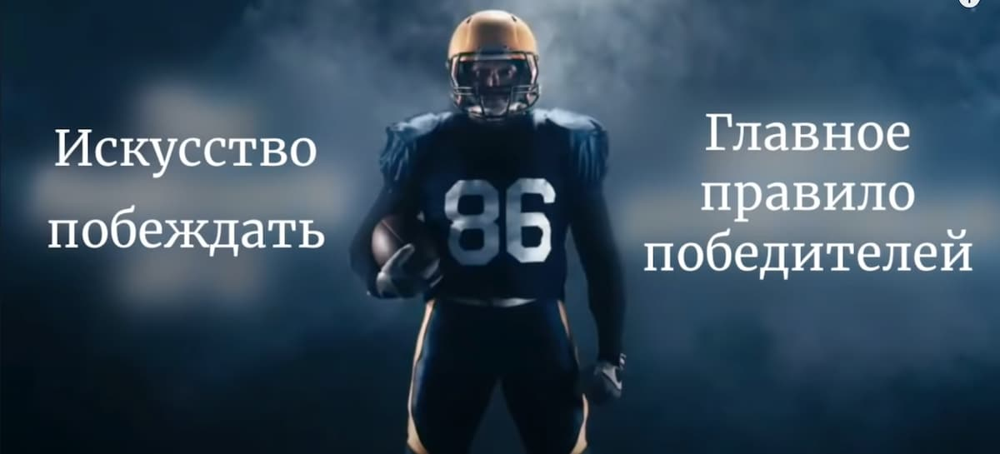
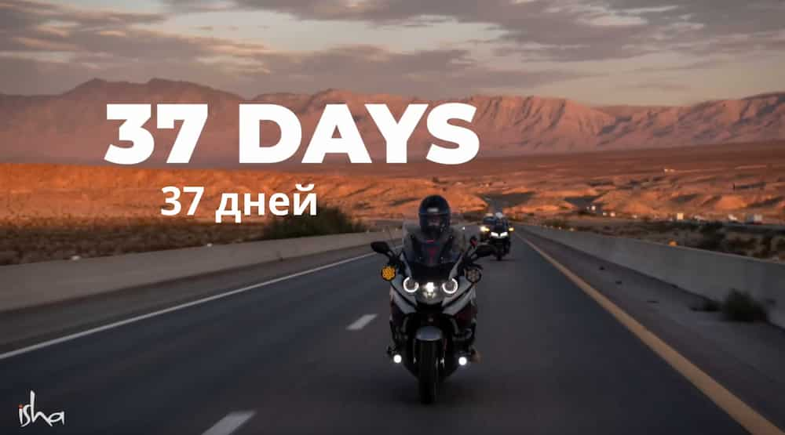

# Основные методы перевода текста

-   _Наложить текст с непрозрачным бекграундом._  
     Подходит для ситуации, когда фон в месте, где размещен текст одноцветен,
    но обычно это не так, и лучше использовать другие методы.
-   _Наложить gaussian blur на место где находится текст, и добавить
    свой поверх._

    -   Универсальный способ, подходит для динамического бекграунда, и,
    обычно, смотрится неплохо. - Ниже пример, где лучше было использовать `blur`.
    <figure markdown>
    { width="300" }
    <figcaption>Not nice...</figcaption>
    </figure>
    <figure markdown>
    { width="300" }
    <figcaption>Nice!</figcaption>
    </figure> 
    
    -   Если фон сливается с переведенным текстом, или `blurred` английскй
    текст добавляет слишком много белого / черного на фон, то можно
    добавить полупрозрачный бекграунд на переведенный текст.

-   _Зафиксировать кадр, когда английский текст еще не появился._
    -   Подходит в случае статической картинки на бэкграунде. Если на
        заднике красивая анимация — `blur` предпочтительнее.
    -   Если в оригинале естть zoom (динамическое увеличение
        статической картинки) для добавления динамики, то нужно
        добавить `zoom` и при переводе.  
        P.S. В обучающих материалах есть видео-пример этого способа.
-   _Перевод сбоку._  
     Иногда, когда анимация особенно сложная, или не хватает времени на блюр, или так просто будет лучше смотреться, можно поставить перевод рядом.  
     **Note**: мы редко используем этот способ.
      <figure markdown>
       { width="300" }
      </figure>
-   _Если есть stem (видео без английского текста)._  
     В данном случае действуем так: скачиваем и оригинал с текстом, и стем.
    Добавляем их один поверх другого, и монтируем. В конце можно просто
    отключить (сделать невидимым) трек с английским текстом.  
     Для заголовков, субтитров и т.д. стараемся, по возможности, выбирать
    красивые эффекты вместо просто эффекта `Text`.
