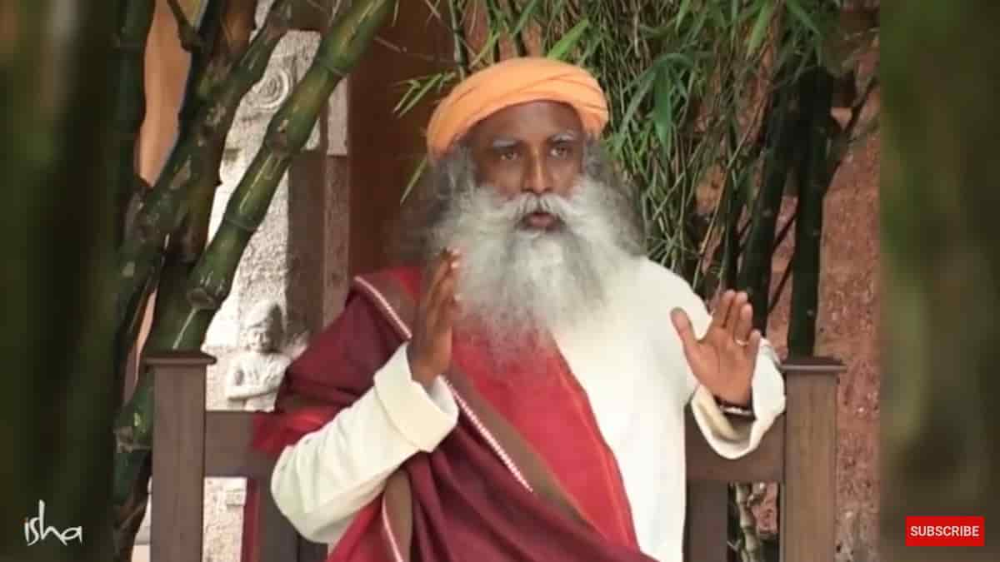
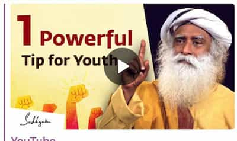

# Монтаж для YouTube

Мы ведем русский канал на YouTube, и команда монтажа занимается
русификацией английских видео.

### Процесс

-   От аудио команды поступает mix с финальной аудио-дорожкой
-   От команды переводчиков поступает перевод текста в видео

После чего мы монтируем видео, и оно отдается следующей команде.

---

## Рекомендации

В рекомендациях мы выделили наилучшие практики, которые позволяют
выдерживать качество и сохранять общий стиль.

### Параметры экспорта

-   формат — `.mp4`;
-   кодек — `H264`;
-   битрейт видео — `3-10mbps`;  
    Если ваш интернет не позволяет 10mbps можно взять битрейт чуть выше, чем в оригинальном видео (обычно где-то 2-3 mbps).
-   битрейт аудио — `320`;
-   разрешение — `1920 × 1080`;  
    Если разрешение оригинала `1280 × 720`, то фиальное видео делаем в формате `1920 × 1080`
    (рекомендательные алгоритмы YouTube поощряют высокоформатные видео).  
    Но, если качесво `480` или ниже — то оставляем качесво оригинала
    (растягивать `480` до `1080` уже перебор).
-   названия — в едином формате.
    Нужно добавить «Output\_» в начало видео и заменить все пробелы и особые символы в имени видео на desh «-».
    Обычно, название будет уже в задании.  
    Пример: `Output_How-Video-Games-Affect-Your-Development-Sadhguru.mp4`

### Заставка в конце

-   Конечный слайд нужно заменять на [русский](https://drive.google.com/file/d/11NbSgvq8LbxDcy-a2WY5OJTKUZKcZx88/view).
-   Конечная надпись «© Sadhguru 2015» не меняется (независимо от года).

Часто используемые слайды & музыку можно найти на Google Drive
[ishaeu.org/RUMontage](https://ishaeu.org/RUMontage) в папке `useful_files`.

### Тайтлы

В задании есть два перевода тайтлов: `TN_TITLE` и `TITLE`.

-   `TN_TITLE` — текст, который будет на thumbnail (заставка на видео).
-   `TITLE` — текстовое название видео.
    Так же, часто будет несколько вариантов названий в `TN_TITLE` и` TITLE` с одним выделенным.

При монтаже, наш приоритет — `TN_TITLE`, но можно выбрать и любой другой из списка. Например,
если `TN_TITLE` слишком длинный, или, по каким-то причинам, будет плохо смотреться.

### Шрифты

-   Отдел дизайна Иши дал следующие шрифты: `Merriweather` — для заголовков и крупного текста,
    и `Open Sans` — для субтитров. Используем их.  
     Иногда используется `Segoe Script`, вы его сразу заметите. Пример:
    { width="120" }  
     Их можно скачать и установить из Google Fonts:

    -   Merriweather: [fonts.google.com/specimen/Merriweather](https://fonts.google.com/specimen/Merriweather)
    -   Open Sans: [fonts.google.com/specimen/Open+Sans](https://fonts.google.com/specimen/Open+Sans)
    -   Segoe Script: наш [Google Drive](https://ishaeu.org/RUMontage)

    P.S. Устанавливать шрифты не сложно, тут можно найти [инструкцию для macOS](lessons/tech-support.md#macos).

### Старые видео

-   У квадратных видео дублируем его-же на бекграунд, растягивем до границ, и накладываем blur.
      <figure markdown>
       { width="300" }
       <figcaption>В случае с еправильным отношением сторон</figcaption>
      </figure>
-   Устаревшие заставки _«Sadhguru. Yogi, mystic and visioner»_ и _«Conversation
    with Mystic»_ вырезаются.  
     **Причины**: они не несут особой пользы и отнмают время.

### Монтаж без аудио

Когда аудио-трек задерживается, иногда, монтируем в два этапа: один
волонтер монтирует (практически) все видео, и второй — заменяет аудио
дорожку.

В таком случае, первому монтажеру следует **оставлять длинну видео-ролика
неизменной**. То есть, не стоит вырезать фрагменты или удлинять их.

**Причины**: второму человеку, обычно, будет гораздо проще самому это
сделать (вырезать или удлинить), чем потом сводить аудио.

---

## Обучающие материалы

Если вы владеете английским — можете посмотреть только два первых плей листа. Иначе — смотрите последний, он старее, но тоже подходит.

1. Playlist with in-depth DaVinci tutorial for beginners (~40 mins).
 <iframe
     class="player"
     type="text/html" src="https://www.youtube.com/embed?listType=playlist&list=PLh5_jWWTZhbKxKjg5jFOVWOsRPZeraTs0"
     frameborder="0">
 </iframe>
    
1. Playlist with techniques to replace text in video (~20 mins). I advice to check it out it even if you have experience with video editing =)
 <iframe
     class="player"
     type="text/html" src="https://www.youtube.com/embed?listType=playlist&list=PLh5_jWWTZhbJtM7l3JlsRALu9Vo-9Y6HZ"
     frameborder="0">
 </iframe>
 
 1. Плейлист с подробным видео-примером монтажа видео в DaVinci и техниками замены текста.
 <iframe
     class="player"
     type="text/html" src="https://www.youtube.com/embed?listType=playlist&list=PLm5ihv4nPkIsgng5bVrOIfsoICxOk1I2Y"
     frameborder="0">
 </iframe>

---

## Тренировочное задание

Задание — смонтировать видео и выслать результат ответным сообщением.

Вы можете загрузить видео напрямую в Telegram.

-   [Оригинал видео](https://www.youtube.com/watch?v=9sGJUR7stzc)
-   [Аудио трек](https://drive.google.com/file/d/1Y6ECjMSvkaUFmNawIePfFvqS2ZnB3SPi/view?usp=sharing)
-   [Русскоязыное видео для сравнения](https://youtu.be/Q3NYDF4JyTg)
-   `TN_TITLE`: Как прожить невероятную жизнь
-   Перевод субтитра на 08:10: «Тайир» на тамильском означает йогрт

{ width="150" align="right" }

P.S. На русском канале довольно уродливый субтитр,
призываю вас улучшить его =).

P.P.S. Thumbnail (картинка справа) делает команда дизайнеров, не монтажер.

